# 《信号与系统》离散时间一维和二维卷积
### <font face=楷体 size=3>上海交通大学  徐日晞 </font>
---
在《信号与系统》中的卷积和深度学习中的卷积有如下的区别
- 信号中的卷积的定义是
  $$y[n]=\sum_{i=-\infty}^{+\infty}x[i]h[n-i]$$
  在深度学习中卷积一般实现为
  $$y[n]=\sum_{i=-\infty}^{+\infty}x[i]h[n+i]$$
  严格上属于互相关运算。将卷积核翻转再做互相关运算，效果等价于直接卷积。只不过在深度学习中，卷积核不是给定的，而是需要学习的，因此我们直接采用更为简便的互相关运算。
- 在信号中，对于长度为$m$的样本和长度为$n$的卷积核，其输出的长度是$m+n-1$，也就是需要在输入两边pad上$(n-1)$的零元素，再让整个卷积核在输入滑动。
  
  在深度学习中，我们一般直接让卷积核在输入样本内滑动，输出长度为$m-n+1$，如果需要改变长度，需要通过增加padding参数实现。
## 卷积的程序实现
代码文件``my_conv.py``
### 一维卷积的程序实现
我们实现信号中的卷积。 定义输入、卷积核、输出均为一维数组，用numpy实现。

最原始的想法当然是套两层for循环，外层依次变量输出的下标$n$，内层计算每个下标的结果
```python
def my_1d(signal,kernel):
    len1=len(signal)
    len2=len(kernel)
    len3=len1+len2-1
    result=np.zeros(len3)
    signal=np.pad(signal,(len2-1,len2-1),"constant",constant_values=0)
    print(f"输出长度{len(result)}")
    for i in range(0,len3):
        for j in range (0,len2):
            result[i]+=kernel[len2-j-1]*signal[i+j]
    return result 
```
在python里面for循环是比较慢的，我们可以优化内层的计算，直接计算两个“窗口”的内积，得到如下改进的程序
```python
def my_1d_fast(signal,kernel):
    len1=len(signal)
    len2=len(kernel)
    len3=len1+len2-1
    kernel_flipped = kernel[::-1] 
    result=np.zeros(len3)
    signal_padded=np.pad(signal,(len2-1,len2-1),"constant",constant_values=0)
    print(f"输出长度{len(result)}")
    for i in range (0,len3):
        signal_window = signal_padded[i : i + len2]
        result[i]=np.dot(signal_window,kernel_flipped)
    return result   
```
我们用python自带的time库测试它们的性能，基于``1d_conv_demo.py``，稍作改动，得到``time_test_1d.py``，设计了两个卷积核，让它们去卷上课铃声，分别计算**卷1次**和**卷10次**的时间。多次运行取平均值。
```python
kernel1 = np.array([-1,2,-1],dtype=np.float64) 
kernel2=np.array([1/3, 1/3, 1/3],dtype=np.float64)
start_time=time.perf_counter()
for i in range(10):
    sharpened_signal = my_1d_fast(signal, kernel1)  
    down_signal=my_1d_fast(signal,kernel2)
end_time=time.perf_counter()
```
|实现方法|卷1次平均时间/s|卷10次平均时间/s|
|-------|---------|---|
|my_1d|1.81|18.22|
|my_1d_fast|**1.74**|**17.66**|

可见my_conv1_fast虽有优化，但效果不明显。

为进一步压榨性能，我们可以引入JIT即时编译。python是解释语言，每次都要动态检查传入的变量，在多次运行就会很慢，JIT能在程序首次执行时，将源代码**编译**成本地的机器码，并缓存结果。后续的调用将直接运行这个高度优化的机器码，从而极大地提升了执行速度。

我们可以用JIT装饰整个函数。它的要求是函数内的语言不能是过于复杂的语法（比如不能有try except，不能打印等），实测np.pad就编译不了，但是JIT对np.dot有比较好的适配，为此，手动实现padding
```python
from numba import jit
@jit(nopython=True)
def my_1d_jit(signal,kernel):
    len1=len(signal)
    len2=len(kernel)
    len3=len1+len2-1
    kernel_flipped=kernel[::-1] 
    result=np.zeros(len3)
    pad_width=len2-1
    signal_padded=np.zeros(len1+2*pad_width)
    signal_padded[pad_width:pad_width+len1]=signal
    for i in range(len3):
        signal_window=signal_padded[i:i + len2]
        result[i]=np.dot(signal_window, kernel_flipped)
    return result
```
|实现方法|平均时间/s|
|-------|---------|
|my_1d|18.22|
|my_1d_fast|17.66|
|my_1d_jit|**4.99**|
可以看到JIT在多轮运行时有显著优势

### 二维卷积的程序实现
输入和输出是用numpy储存的二维数组

最原始的实现当然还是for循环，4层循环，外层遍历每个位置，内层计算每个位置
```python
def my_2d(signal,kernel):
    lenm=np.size(signal,axis=0)# m是行数，n是列数
    lenn=np.size(signal,axis=1)
    m=np.size(kernel,axis=0)
    n=np.size(kernel,axis=1)
    signal=np.pad(signal,((m-1,m-1),(n-1,n-1)),'constant',constant_values=0)
    result=np.zeros((lenm+m-1,lenn+n-1))
    for i in range(0,lenn+n-1):
        for j in range(0,lenm+m-1):
            for x in range(0,m):
                for y in range(0,n):
                    result[i][j]+=signal[i+x][j+y]*kernel[m-x-1][n-y-1]
    return result
```
同样，用内积+JIT改进如下
```python
@jit(nopython=True)
def my_2d_jit(signal,kernel,keep=False):
    lenm,lenn=signal.shape # 信号的大小
    m,n=kernel.shape # 卷积核的大小
    assert (m%2==1 and n%2==1)
    result=np.zeros((lenm+m-1,lenn+n-1))
    signal_padded=np.zeros((lenm+2*m-2,lenn+2*n-2))
    signal_padded[m-1:m+lenm-1,n-1:n+lenn-1]=signal
    kernel_flipped = np.flip(kernel)
    for i in range(lenm+m-1):
        for j in range(lenn+n-1):
            signal_window = signal_padded[i : i + m, j : j + n]
            result[i, j] = np.sum(signal_window * kernel_flipped)
    if keep:
        return result[(m-1)//2:(m-1)//2+lenm,(n-1)//2:(n-1)//2+lenn]
    return result
```
## 卷积的pytorch实现和比较
测试代码文件 ``test_my_conv.py``
### 使用pytorch实现一维卷积
```python
def my_1d_torch(signal, kernel):
    kernel_flip = kernel[::-1].copy()
    kernel_tensor = torch.tensor(kernel_flip, dtype=torch.float64).unsqueeze(0).unsqueeze(0)  # 转换为tensor
    signal_tensor = torch.tensor(signal, dtype=torch.float64).unsqueeze(0).unsqueeze(0)  # 转换为tensor
    result = F.conv1d(signal_tensor, kernel_tensor, padding=kernel.shape[0]-1)
    return result.squeeze().detach().numpy()
```
注意这里pad是shape[0]-1不是shape[0]//2，因为我并不是想要输出和输入规模相同，而是遵照信号与系统中的定义。

### 测试结果一致性
```python
signal_test = np.array([1, 2, 3, 4], dtype=np.float64)
kernel_asymmetric = np.array([1, 2], dtype=np.float64) 
result_jit = my_1d_jit(signal_test, kernel_asymmetric)
result_torch = my_1d_torch(signal_test, kernel_asymmetric)
print("JIT结果:  ", result_jit)
print("PyTorch结果:", result_torch)
print("结果是否一致:", np.allclose(result_jit, result_torch))
```
输出相同。值得一提的是，使用pytorch的卷积10轮算下来只用0.03秒，说明手动实现的还是有很大优化空间的。
### 使用pytorch实现二维卷积
```python
def my_2d_torch(signal, kernel,keep=False):
    m,n=kernel.shape
    assert (m%2==1 and n%2==1)
    kernel_flip = np.flip(kernel).copy()
    kernel_tensor = torch.tensor(kernel_flip, dtype=torch.float64).unsqueeze(0).unsqueeze(0)
    signal_tensor = torch.tensor(signal, dtype=torch.float64).unsqueeze(0).unsqueeze(0)  # 转换为tensor
    if keep:
        return F.conv2d(signal_tensor, kernel_tensor, padding=((m-1)//2,(n-1)//2)).squeeze().detach().numpy()

    return F.conv2d(signal_tensor, kernel_tensor, padding=(m-1,n-1)).squeeze().detach().numpy()
```
注：
在2D的卷积中，为了后面操作的需要，设置keep的选项，其为真时，将通过合适的padding将输出和输入设置为一样的size，同时为了padding的方便，保持对称性，我们断言卷积核的size都是奇数。

### 测试结果一致性
```python
signal2=np.random.rand(10,10)
kernel2=np.random.rand(3,3)
result_jit1 = my_2d_jit(signal2, kernel2,keep=False)
result_torch1 = my_2d_torch(signal2, kernel2,keep=False)
print(result_jit1)
print(result_torch1)
print("结果是否一致:", np.allclose(result_jit1,result_torch1))
```
分别置keep=True和False均通过检验。

---

<mark>
注：下面的操作我们分别调用前面自己实现的卷积函数和使用pytorch库的卷积函数
</mark>

## 一维语音信号的卷积
代码文件 ``1d_conv.py``

可以使用vscode的插件audio prewiew查看声音信号的波形图，梅尔谱等

原始波形
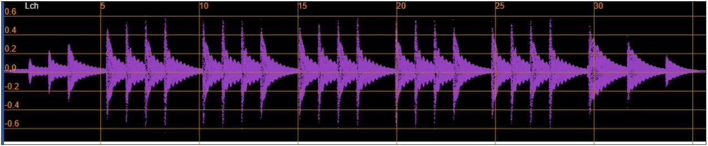
### 锐化
$$ \begin{bmatrix}
-1& -1& 5&-1&-1
\end{bmatrix}$$
工作原理：
该卷积核将中间位置的信号放大，并抑制两侧的信号，也可以理解为是中间信号和两侧信号的差值，如果中间位置发生信号的突变，那么卷积后的响应值会较大；如果该段时间音频信号保持不变，那么卷积后将不会发生变化。

考察 
$$ \begin{bmatrix}
-1& -1& 5&-1&-1
\end{bmatrix}\cdot  \begin{bmatrix}
x_0 & x_0 &x_0 &x_0 &x_0
\end{bmatrix}=x_0$$
$$ \begin{bmatrix}
-1& -1& 5&-1&-1
\end{bmatrix}\cdot  \begin{bmatrix}
x_0 & x_0 &4x_0 &x_0 &x_0
\end{bmatrix}=16x_0$$
卷积核在计算时会突显音频信号的突变或高频成分，减弱平滑部分，增强音频的细节，使得音频听起来更加“锐化”。
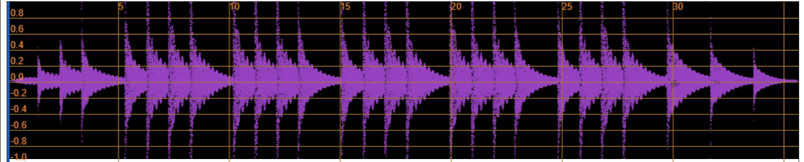
可以看到，经过锐化卷积后，音频信号的突变部分（铃声的每个deng的声音）被加强，表现出来铃声会更尖锐。
### 加噪和去噪
加噪不需要卷积，而是逐元素加上一个服从高斯分布的随机噪声，加噪后的波形可视化如图所示
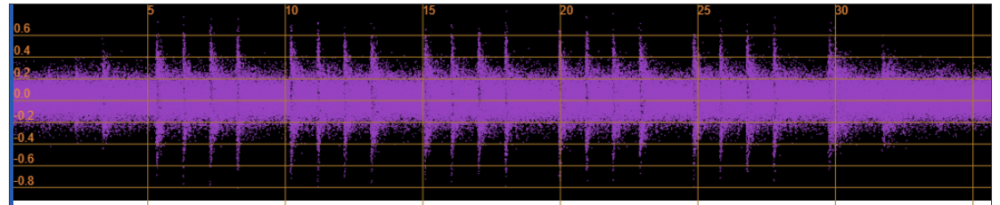
可见波形在[-0.2,0.2]增加了更多噪声，表现在音频里就是更多背景杂音。
#### 均值卷积核
$$ \begin{bmatrix}
\frac{1}{n}& \frac{1}{n}& ...&\frac{1}{n}&\frac{1}{n}
\end{bmatrix}\in \mathbb{R}^{1\times n}$$
这相当于和前后的信号做平均。

- 对噪声: 由于我们加的是高斯噪声，它的特点是随机和独立，以均值为0采样。故在一定时间窗口内平均值也接近于零，从而取平均值能消去部分噪声。
- 对于原始信号: 在一个很小的局部窗口内，信号的变化是有趋势、有规律的。如果当前点的值是0.8，那么它旁边的点很可能也是0.8附近的值，比如0.79或0.81，它们的平均值仍然会非常接近0.8。所以，原始信号本身损失不大。
  
  当然，正如在前面锐化中提到的，如果原始音频中存在突变部分，那么平均卷积会把它削弱了。

  合理选择$n$也很重要，太大的$n$会把原始音频也平滑掉。下图中，上面为$n=10$的结果，可见噪声明显减少，和原始声音相似。下面为$n=1000$的结果。可见$n$太大会产生荒谬的结果，效果适得其反。

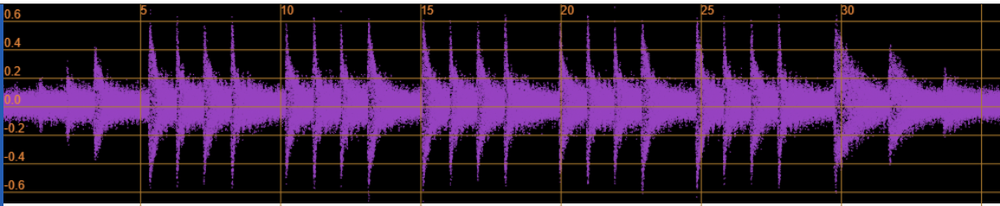
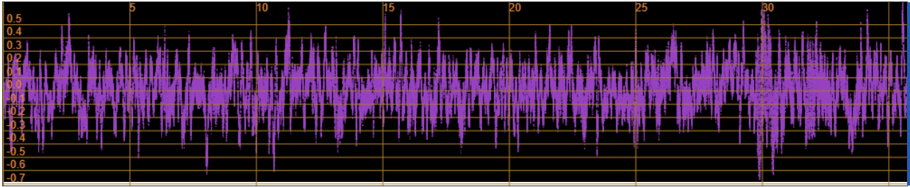

#### 高斯卷积核
$$
G(x)=\frac{1}{\sqrt{2\pi}\sigma} {e^{-\frac{x^2}{2\sigma^2}}}$$
$x$为到中心点的距离，$\sigma$是参数

在实际构造时，我们一般先计算${e^{-\frac{x^2}{2\sigma^2}}}$，然后对其归一化即可。代码实现如下
```python
def gaussian_kernel(size, sigma):
    x = np.linspace(-size // 2, size // 2, size)
    kernel = np.exp(-x**2 / (2 * sigma**2))
    return kernel / np.sum(kernel)
```


原理：就像上面提到的，平均卷积会导致一个副作用：边缘模糊。当信号有一个急剧的变化时会把这个尖锐的边缘“平均掉”，使其变得平缓。

作为改进，高斯核引入加权平均，权重来自高斯分布。离中心点越近的采样点，与中心点的关系越密切，应该给予更高的权重，而远处点的权重很低。这能更好地保留边缘，使其不容易被模糊。

$\sigma$参数需要调整，下图分别展示了$\sigma=5,10,20$ 的结果，可见$\sigma=5$ 时效果较好。
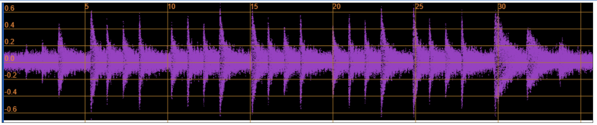
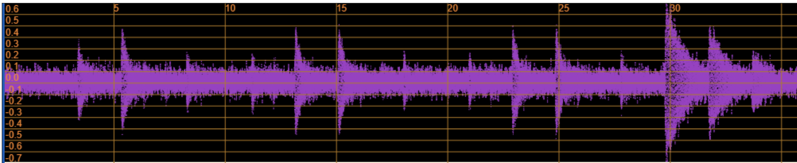
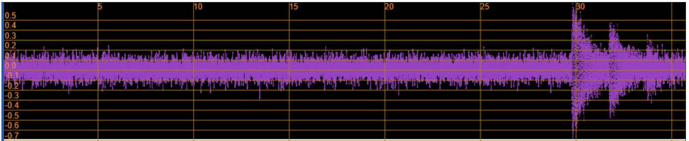

## 二维图像信号的卷积
代码文件 ``2d_conv.py``
### 加噪和去噪

#### 均值卷积核
最常见的 **3x3 均值核**:

$$
\frac{1}{9} \begin{bmatrix}
1 & 1 & 1 \\
1 & 1 & 1 \\
1 & 1 & 1
\end{bmatrix}
$$
就像一维卷积所提到那样，均值卷积在去噪同时，**会使图像的边缘和细节变得模糊**，如下图所示。
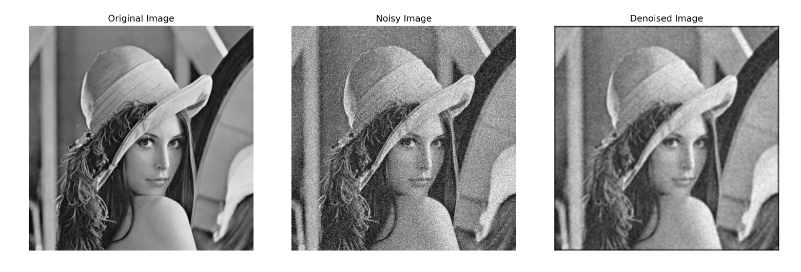
#### 高斯卷积核 
进行加权平均，离中心像素越近的邻居权重越高，越远的权重越低。权重分布符合二维高斯函数。
$$ G(x, y) = \frac{1}{2\pi\sigma^2} e^{-\frac{x^2+y^2}{2\sigma^2}}$$
例如，σ≈1、3x3的高斯核:
$$
K \approx \frac{1}{16} \begin{bmatrix} 
1 & 2 & 1 \\
2 & 4 & 2 \\
1 & 2 & 1
\end{bmatrix}
$$
去噪效果比均值滤波更平滑、自然，**对边缘的保留能力更好**。
### 边缘提取
边缘一般是像素突变的位点，我们可以用梯度大小衡量突变情况。

#### Sobel算子
$$ G_x=\begin{bmatrix}
-1 &0&1\\
-2 &0&2\\
-1& 0&1\\
\end{bmatrix}\ \  G_y=\begin{bmatrix}
-1 &0&-1\\
0 &0&0\\
1& 2&1\\
\end{bmatrix}$$
原理： $G_x$相当于在$x$方向求**一阶导**（中心差分），因而在水平方向有突变的位置会被强化，故用于检测垂直边缘；$G_y$是$G_x$的转置，用于检测竖直边缘。

下面我们用我在香港地铁拍的一张照片作为试验，原图如下
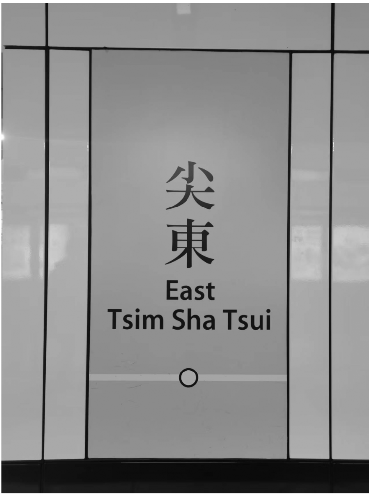
垂直边缘检测
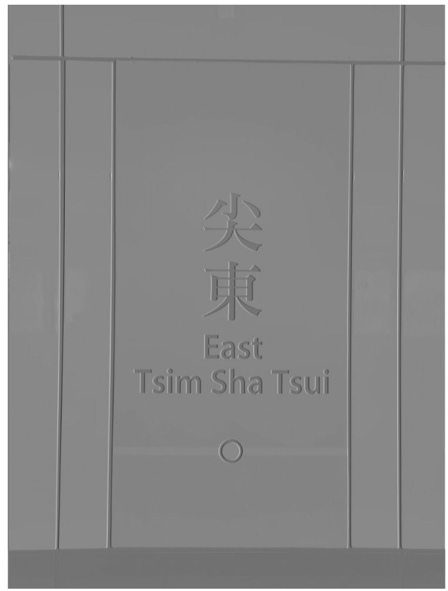
水平边缘检测
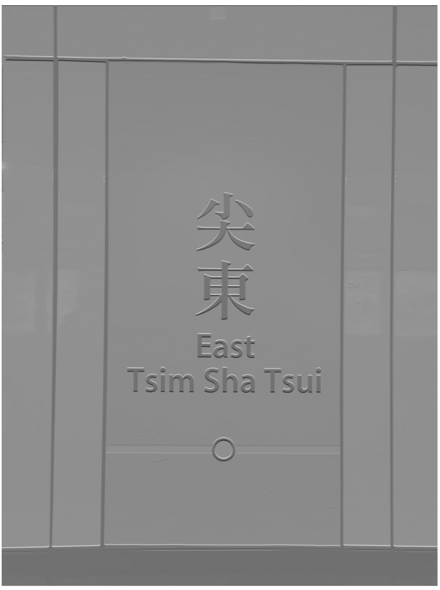
可见$G_x$和$G_y$分别对垂直和水平边缘做了强化。例如，垂直边缘核卷积后，图片的垂直线条，例如瓷砖上的竖线、“尖东”的竖画，得到了强化（白色部分）。
#### Laplace算子
$$L=\begin{bmatrix}
0 &1&0\\
1 &-4&1\\
0& 1&10\\
\end{bmatrix}$$
原理：它计算的是每个位置的二阶导数
$$
\nabla^2 f = \frac{\partial^2 f}{\partial x^2} + \frac{\partial^2 f}{\partial y^2}
$$
一维情况下，二阶导的中心差分可以写成：
$$
\frac{\partial^2 f}{\partial x^2} = f(x + 1) - 2f(x)+ f(x - 1)
$$

$$
\frac{\partial^2 f}{\partial y^2} = f(y + 1) - 2f(y) + f(y - 1)
$$
那么得到上述二阶微分：
$$
\nabla^2 f = \frac{\partial^2 f}{\partial x^2} + \frac{\partial^2 f}{\partial y^2} = [f(x + 1, y) + f(x - 1, y) + f(x, y + 1) + f(x, y - 1)] - 4f(x, y)
$$
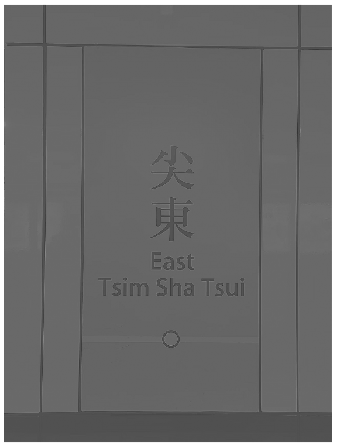
可以看到Lapalce卷积后并没有提取的明显的边缘，效果并不好。

分析：Laplace是二阶导数，它寻找的是图像强度变化率的顶点。它在平坦区域和**线性渐变区域**的响应都接近于零，注意线性渐变在一阶导的Sobel算子是有响应的，但在Lapalce中没有。
而我拍的这个香港地铁的照片，大面积的灰色面板是平坦区域，Laplace算子在这些区域的输出就接近0。

文字“尖東”和英文字母的边缘虽然清晰，但在真实拍摄的图像中，它们总有1-2个像素的**平滑**过渡，导致二阶导数的响应值会非常小。
#### Canny算子
代码文件 ``canny.py``

Sobel算子只能提取水平或竖直方向的边缘，提取各方向边缘的卷积核有Laplace算子等，综合前面讲的各种方法，介绍Canny算子，能有效提取各方向的边缘

原始图像 → 降噪 → 求梯度 → 细化边缘 → 筛选边缘 → 最终结果

- 先用前面提到的高斯核去除图像噪声，避免噪声被误判为边缘，这会模糊图像，但保留主要结构
- 使用Sobel算子分别计算水平和垂直方向的梯度幅值和方向
  $$
  G = \sqrt{G_x^2 + G_y^2}
  $$
  $$
  \theta = \arctan\left(\frac{G_y}{G_x}\right)
  $$
  - 梯度幅值大 → 该点可能是边缘
  - 梯度方向 → 告诉我们边缘的朝向

- 非极大值抑制：沿着梯度方向，只保留局部最大值

  1. **将梯度方向量化为4个方向**
  2. **比较当前像素与梯度方向上的两个邻居**：
  例如：如果梯度方向是水平
  比较：左边像素 ← [当前] → 右边像素

  只有当当前梯度值 $\ge$ 左右邻居时才保留
  否则设为0


- 双阈值检测
使用两个阈值（$T_{high}$ 和 $T_{low}$）
    - 大于$T_{high}$ 直接保留
    - 小于$T_{low}$ 直接丢弃
    - 介于两者之间：检查其8邻域，如果邻域中有强边缘，保留，否则丢弃
        

可见Canny算子能够提取各方向的边缘，形成完整的轮廓。

